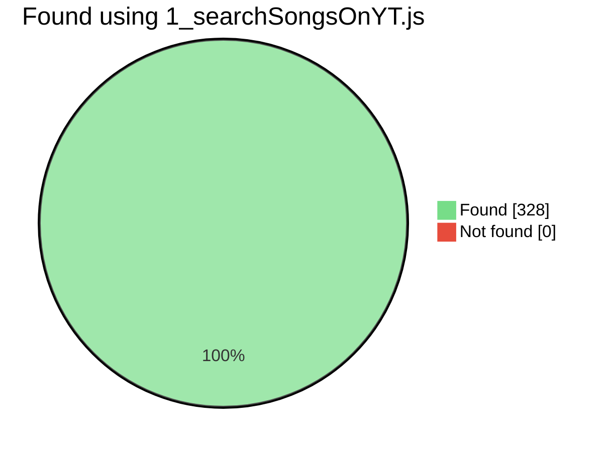
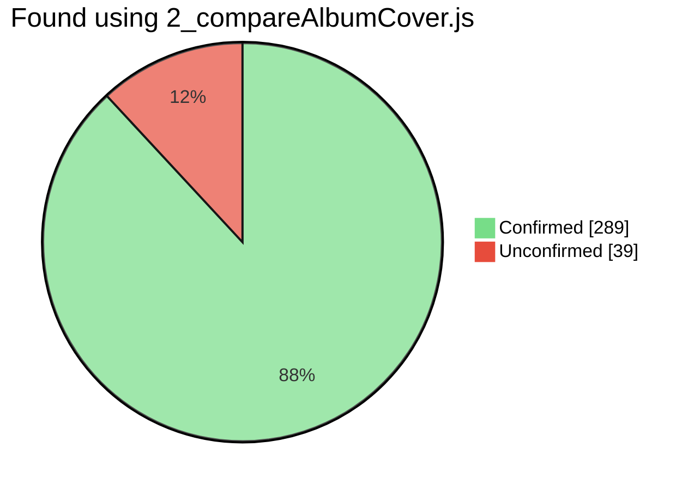
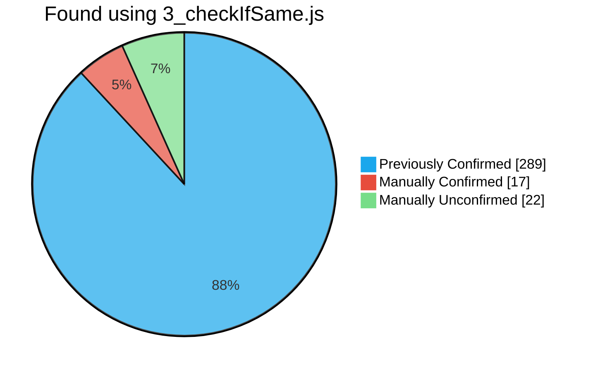
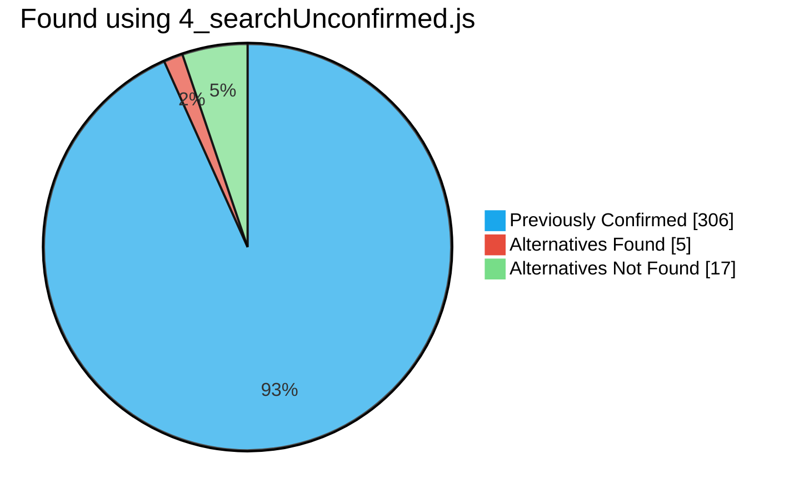
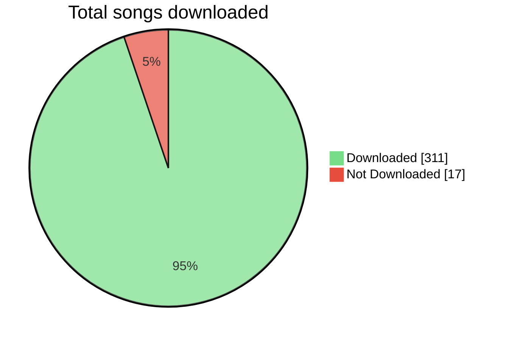

# Spotify to YouTube Download
Download a Spotify Playlist using YouTube Music. The mp3 files will be downloaded into the `./songs` folder and will include ID3 tags (Title, Artist, Album, Year, Image).

> Proof of concept as it is probably againgst TOS.

## Installation
### Prerequisites
- Have node.js and npm installed
  - You can install them [here](https://nodejs.org/en/download/)
- Have [FFmpeg](https://ffmpeg.org/download.html) installed
  - Windows ([Chocolately](https://chocolatey.org/install)): `choco install ffmpeg`
  - macOS ([Homebrew](https://brew.sh/)): `brew install ffmpeg`
  - Linux: `sudo apt install ffmpeg`
- Modify `config.json` with your Spotify credentials (Client ID, Client Secret and Playlist ID) and the thresholds for the album cover similarity and maximum duration difference.
  - Go to [Spotify Developer Dashboard](https://developer.spotify.com/dashboard) and create a new app
  - Copy the Client ID and Client Secret into `config.json`
  - Also add the Spotify Playlist ID you want to download. You can get it from the Spotify URL (e.g. `https://open.spotify.com/playlist/0BxSFctZ12PYY7ysO9mrTc` → `0BxSFctZ12PYY7ysO9mrTc`)
  - Modify `similiarity_percentage` and `duration_difference` to change the threshold for the songs to be considered equal between platforms. 
    - `similiarity_percentage` is the percentage of pixels that have to be similar between the album covers.
    - `duration_difference` is the maximum difference in seconds between the Spotify and YouTube Music song duration.

## Steps
1. Clone the repository: `git clone https://github.com/MaxPuig/spotify-to-yt-download.git`
2. Install libraries: `npm install`
3. Modify `config.json` with your Spotify `clientId`, `clientSecret`, and `playlistId`
4. Run the scripts in order
   1. `node 1_searchSongsOnYT.js` - Search for the Spotify songs on YouTube Music.
   2. `node 2_compareAlbumCover.js` - Compare the Spotify and YouTube Music album covers and playtime.
   3. `node 3_checkIfSame.js` - (Recommended/Optional) Open http://localhost:1234/ and choose if the songs match. This step is optional if you trust the previous step, you won't download the songs that didn't match the album cover or the difference between song duration was higher than the maximum set in `config.json`.
   4. `node 4_searchUnconfirmed.js` - (Optional) Open http://localhost:1234/ and choose an alternative YouTube video/song. This step is optional if you don't want to search for an alternative song from the "different" songs from the previous step.
   5. `node 5_yt2mp3.js` - Download the songs to the `./songs` folder.
5. Enjoy your songs in the `./songs` folder!

## Notes
When testing `1_searchSongsOnYT.js`:
- 100% of songs had a candidate on YouTube Music. This value, however, is not 100% accurate as some song will probably be **wrong**.
  - Found: 328/328.
  - Not found: 0/328.

When testing `2_compareAlbumCover.js`:
- 88% of songs were automatically confirmed, meaning they had the same album cover and the same song duration (within the threshold set in `config.json`).
  - Confirmed: 289/328.
  - Unconfirmed: 39/328.

When testing `3_checkIfSame.js`:
- 44% of the unconfirmed songs were false positives. They were marked as unconfirmed when actually they were the same song but with a different album cover or a different song duration.
  - Manually confirmed: 17/39.
    - Total confirmed: 306/328 (93%).
  - Manually unconfirmed: 22/39.

When testing `4_searchUnconfirmed.js`:
- 23% of the unconfirmed songs had an available alternative from the options shown in the browser.
  - 5/22 had an alternative.
    - Total confirmed: 311/328 (95%).
  - 17/22 didn't have an alternative.

Ending up with a total of 311/328 songs downloaded (95%).

